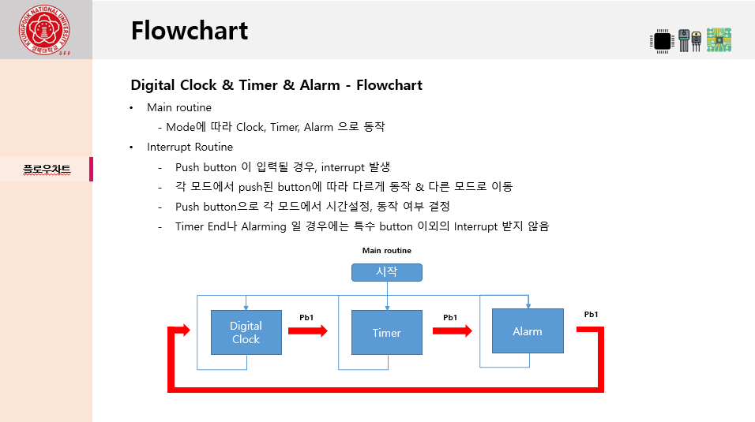

 **본 Repository는 SoC 설계 및 프로그래밍 과목을 수강하며 진행했던 프로젝트에 관한 폴더입니다.**
 
 
 
 
 ### 프로젝트 주제 - Digital Clock & timer
  - zynq7020 보드 기반의 FPGA 프로그래밍과 Arm Programming을 통해 Digital Clock & Timer 를 구현
  
  - LED, 7-Segment, Push Button, Text LCD IP를 Velilog를 사용하여 직접 설계
  
  
  
  
  
  
  ### 설계한 IP
  
  > [LED](https://github.com/Byung-moon/SOC-Programming/tree/master/SoC_Term/ip_repo/led_9.0/hdl)
  
  > [Push Botton](https://github.com/Byung-moon/SOC-Programming/tree/master/SoC_Term/ip_repo/pushbutton_1.0/hdl)
  
  > [Seven Segment](https://github.com/Byung-moon/SOC-Programming/tree/master/SoC_Term/ip_repo/seven_seg_1.0/hdl)
  
  > [TextLCD](https://github.com/Byung-moon/SOC-Programming/tree/master/SoC_Term/ip_repo/textlcd_1.0/hdl)
  
  
  
  ### Main PGM
  
  > [main.c](https://github.com/Byung-moon/SOC-Programming/blob/master/SoC_Term/term_proj/term_project.sdk/ps_term_project/src/main.c)
  
  
  #### 제어 변수
  ```
  char mode=0;                     //mode =0 : clock      mode=1 : timer	mode=2 : Alarm
  
  volatile char set_time = 0;      // 타임 세팅 동작 제어 변수
  volatile char hour = 0;          // 시간(Hour) 설정 제어 변수
  volatile char minute = 0;        // 분(Minute) 설정 제어 변수
  volatile char second = 0;        // 초(Second) 설정 제어 변수
  
  volatile char set_alarm = 0;     // 알람 세팅 동작 제어 변수
  volatile char alarm_hour = 0;    // 알람 시간 설정 제어 변수
  volatile char alarm_minute = 0;  // 알람 분 설정 제어 변수
  volatile char alarm_second = 0;  // 알람 초 설정 제어 변수
  
  ```
  
  
  #### RTC 에서 시간 읽어오기
  ```
  int ReadRTC(XIicPs Iic, u8 *SendBuffer, u8 *RecvBuffer)
  {
  
       ... 생략 ...

      *SendBuffer		= 0x02;     // SendBuffer 와 RecvBuffer를 통해서 시간 저장  
     RecvBuffer[0]	= 0x00;
     RecvBuffer[1]	= 0x00;
     RecvBuffer[2]	= 0x00;
     
     Status = XIicPs_MasterSendPolled(&Iic, SendBuffer, 1, IIC_SLAVE_ADDR); // XIicPs_MasterSendPolled 함수를 통해 I2C 통신 

       ... 생략 ...
       
  }
  ```
  
  
  #### RTC 시간 쓰기
  ```
  int WriteRTC(XIicPs Iic, u8 *WriteBuffer, char set, char val)
  {
  
       ... 생략 ...

      WriteBuffer[0] = set;	// set 변수를 통해 시, 분, 초 선택
      WriteBuffer[1] = val;	// val 변수를 통해 RTC의 레지스터에 값 Write
     
     Status = XIicPs_MasterSendPolled(&Iic, WriteBuffer, 2, IIC_SLAVE_ADDR); // XIicPs_MasterSendPolled 함수를 통해 RTC와 I2C 통신 

       ... 생략 ...
       
  }
  ```
  
  
 
 
 
